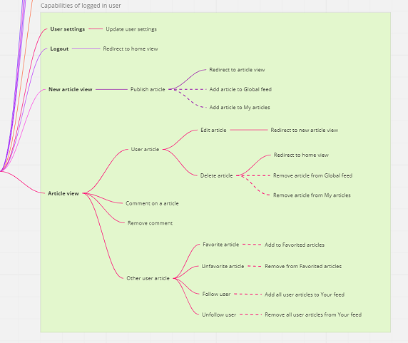

# 
This is exemplary project of E2E tests written in Cypress + TypeScript, using Page Object pattern. Application under test is a Medium.com colne (called [Conduit](https://demo.realworld.io/#/)) 

Frontend and backend was done by [TonyMckes](https://github.com/TonyMckes/conduit-realworld-example-app) with my little modifications. 

- **Reporting**: cypress-mochawesome-reporter
- **Visual regression**: Percy
- **Continous integration**: ???


To see in more details what has been done go to [project board.](https://github.com/users/HubertArciszewski95/projects/2/views/1)

<br>

## **Test strategy**
Visual documentation of the application most important areas ([Conduit mind map](https://miro.com/app/board/uXjVPyTICs0=/?share_link_id=723710348292)).



### Capability test charters
Before writing any E2E tests, I documented the various capabilities of the application that I plan to cover with tests.
- [Authentication](./test-charters/authentication.md)
- [Home page](./test-charters/home-page.md)
- [Settings]
- [Article]

<br>

## Getting Started

### Prerequisites

Before you run the project, make sure that you have the following tools and software installed on your computer:

- Text editor/IDE (e.g., VS Code, Sublime Text, Atom)
- [Git](https://git-scm.com/downloads)
- [Node.js](https://nodejs.org/en/download/) `v18.11.0+`
- [NPM](https://www.npmjs.com/) (usually included with Node.js)
- [PostgreSQL](https://www.postgresql.org/download/)

### Installation

To install the project on your computer, follow these steps:

1. Clone the repository to your local machine.

   ```bash
   git clone https://github.com/HubertArciszewski95/cypress-realworld-example.git
   ```

2. Navigate to the project directory.

   ```bash
   cd cypress-realworld-example
   ```

3. Install project dependencies by running the command:

   ```bash
   npm install
   ```

### Configuration

In the [`backend`](backend/) directory, duplicate and remane the`.env.example` file, name it `.env`, and modify it to set all the required private development environment variables.

> You can run the following command to populate your database with test data:

> ```bash
> npx -w backend sequelize-cli db:seed:all
> ```

<br>

> If you wish to clean DB from all data:

> ```bash
> npx -w backend sequelize-cli db:seed:undo:all
> ```

### Usage

#### Development Server

To run the project, follow these steps:

1. Start the development server by executing the command:

   ```bash
   npm run dev
   ```

2. Open a web browser and navigate to:
   - Home page should be available at [`http://localhost:3000/`](http://localhost:3000).
   - API endpoints should be available at [`http://localhost:3001/api`](http://localhost:3001/api).

#### Running Tests

To run the tests, run one of the following command:

> Headless mode
```bash
npm run cy:run
``` 
<br>

> Open cypress UI
```bash
npm run cy:open
```
<br>

> Specific test suite in headless mode
```bash
npm run cy:run --spec "cypress/e2e/path-to-file"
```

## License

This project is licensed under the MIT License. See the [LICENSE](LICENSE) file for details.
